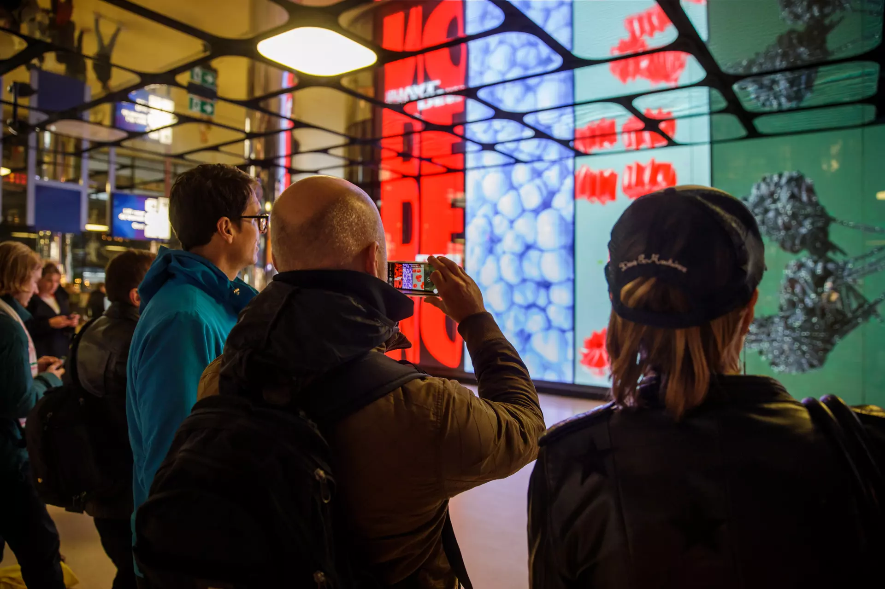
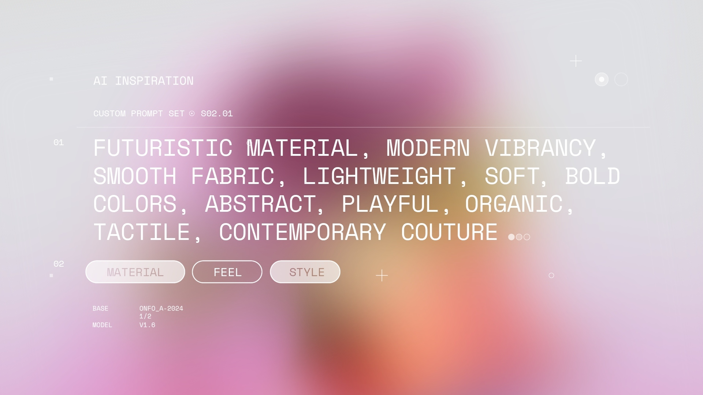
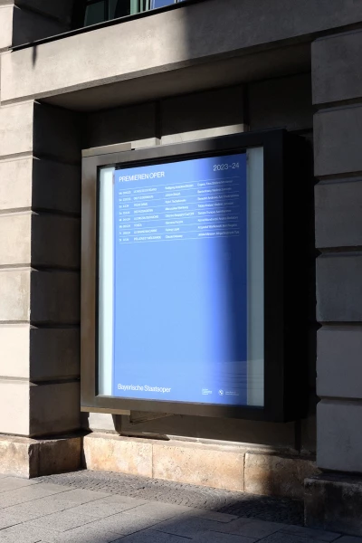
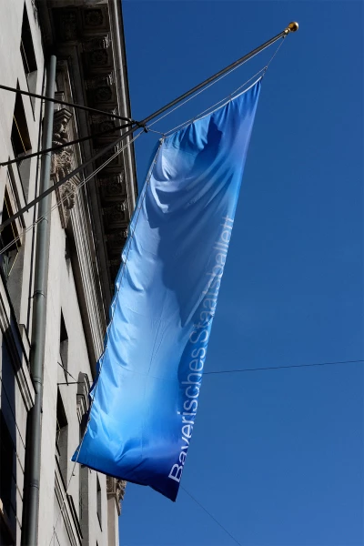
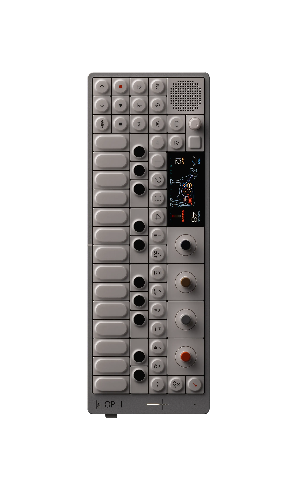
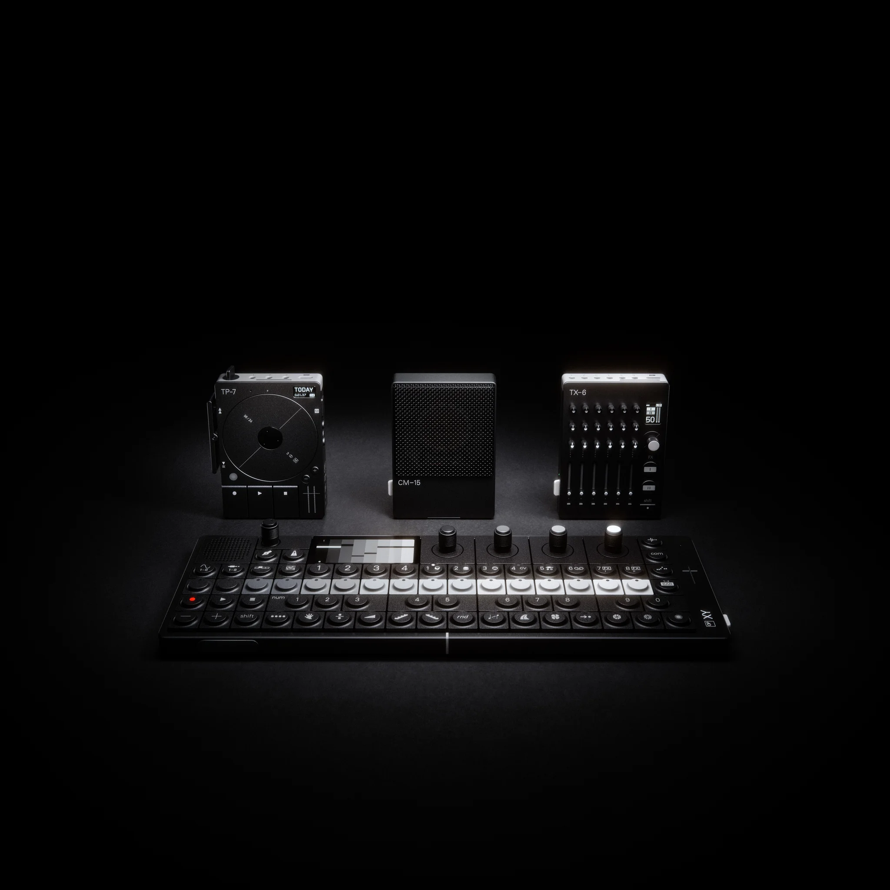
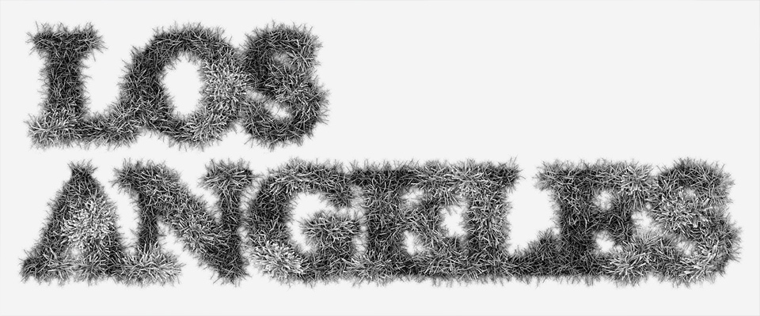

# AFTON REFERENCE CONTACT SHEET — CURRENT

**Phase: B / Reference Contact Sheet**  
**Status: CANDIDATE / MOOD_APPROVAL_REQUIRED**  
**Spec: SPEC VERIFIED BY CODEX / 2026-09-13**  
**Execution: GENERATION HOLD / CREDIT SPEND HOLD / DEPLOY HOLD**

## 1. Primary Motif Review Matrix

아래 평가는 전달된 매니페스트와 모티프 검토 문서를 바탕으로 한 AFTON 적용 제안이다. 실측 결과나 사용자 승인 결과가 아니다.

| Motif | Landing relevance | Visual distinctiveness | Copy-risk | Decision |
|---|---|---|---|---|
| M01 · CONTROLLED VARIATION | HIGH | HIGH | MEDIUM | PRIMARY CANDIDATE: 고정된 편집 체계 안의 반복·변형 규칙 |
| M03 · AMBIGUOUS CENTER | HIGH | HIGH | HIGH | PRIMARY CANDIDATE: 명확한 편집 구조 안의 해석이 열려 있는 시각 요소 |
| M04 · ORDER + ONE CONTRADICTION | HIGH | HIGH | HIGH | PRIMARY CANDIDATE: R08 중심의 소비자용 editorial/magazine 문법 |
| M06 · ARCHIVE / RETURN / TIME | MEDIUM | LOW | MEDIUM | IA ONLY: 정보구조에 적용하고 독립 시각 스타일로 사용하지 않음 |

### 평가 해석

- Landing relevance, Visual distinctiveness, Copy-risk는 LOW / MEDIUM / HIGH로만 평가한다. Decision은 점수가 아니라 적용 판단이다.
- Copy-risk의 HIGH는 채택 강도가 아니라 주의 수준을 뜻한다.
- Visual distinctiveness는 모티프를 AFTON의 시각 문법으로 번역할 때의 구별 가능성에 대한 제안 평가다. 원본 프레임의 독창성을 측정한 점수가 아니다.
- M01은 일관성을 만들지만, 그 자체로 다음 목적지를 설명하지는 않는다.
- M03의 모호함은 이미지의 해석에만 허용한다. 메뉴·콘텐츠 종류·링크 목적지는 명확하게 유지한다.
- M04의 전면 근거는 R08이다. R09는 기능적 계층과 정보 그룹화의 보조 근거로만 사용한다.
- M06의 Visual distinctiveness가 LOW인 것은 이번 적용을 IA로 한정하기 때문이다. 아카이브와 돌아가기 구조의 중요도가 낮다는 뜻이 아니다.
- Supporting M02와 M05는 아래에서 함께 검토하되, 이번 랜딩의 별도 효과나 시스템 구현을 요구하지 않는다.
- 모든 Decision은 검토 제안이며 최종 승인 결과가 아니다.

---

## 2. 근거와 읽는 방법

### 근거 문서

- [research/REFERENCE_MANIFEST.md](../research/REFERENCE_MANIFEST.md)
- [docs/12_MOTIF_REVIEW_CURRENT.md](12_MOTIF_REVIEW_CURRENT.md)
- [docs/13_REFERENCE_CONTACT_SHEET_SPEC.md](13_REFERENCE_CONTACT_SHEET_SPEC.md)

**SPEC VERIFIED BY CODEX / 2026-09-13**

매니페스트 기준 상태는 Phase A collected / motif review / generation HOLD이며, 수집 프레임은 14개다.

### 표기 원칙

**SOURCE, PROJECT, EXACT URL, MANIFEST PATH, MOTIF**는 전달된 문서의 기록을 따른다.

**BORROW, DO NOT COPY**는 매니페스트와 모티프 검토 문서에서 추출한 프로젝트 수준의 원칙이다. 이를 특정 프레임의 세부 외형을 직접 확인한 결과와 혼동하지 않는다.

각 카드의 **AFTON USE**에는 규격의 허용값 중 하나를 표시한다. 그 아래의 적용 제안은 해당 원칙을 AFTON에 번역하는 방식이며, 승인된 디자인이나 이미 구현된 기능이 아니다.

동일 프로젝트의 두 프레임은 각각 별도 카드로 배치한다. `1/2`, `2/2`는 카드 구분이며 새로운 레퍼런스 ID가 아니다.

Markdown 이미지 링크의 `../`는 이 문서가 위치한 `docs/`에서 저장소 루트를 가리킨다. 매니페스트의 파일명과 확장자는 변경하지 않는다.

외부 레퍼런스는 연구용이다. AFTON의 공개 웹사이트 자산, 승인된 생성 입력, 라이선스가 확보된 제작 자산으로 취급하지 않는다.

이전 대화의 생성 이미지 6개는 이번 컨택트 시트의 근거나 승인 자산에 포함하지 않는다.

### 프레임 배치 순서

| 구분 | Motif | 카드 | 프레임 수 |
|---|---|---|---|
| Primary | M01 | R01, R02, R04 | 3 |
| Primary | M03 | R06 | 1 |
| Primary | M04 | R08 두 프레임, R09 두 프레임 | 4 |
| Primary / IA only | M06 | R10 두 프레임 | 2 |
| Supporting | M02 | R03 두 프레임, R05 | 3 |
| Supporting | M05 | R07 | 1 |
| 합계 | | | 14 |

---

# 3. Primary Motif Frames

## M01 · CONTROLLED VARIATION

### R01 · 1/1 · Studio Dumbar / DEMO 2019

**ID:** R01 · 1/1  
**SOURCE:** Studio Dumbar  
**PROJECT:** DEMO 2019  
**EXACT URL:** https://studiodumbar.com/work/demo  
**MANIFEST PATH:** `research/reference-only/22a7be20aa7d21df.webp`  
**MOTIF:** M01 · CONTROLLED VARIATION

**BORROW**  
변수에 의해 형태가 달라져도 식별 가능한 정체성을 유지하는 규칙. 전달된 문서는 자체 스크립트에 의한 가변 타이포그래피와 가독성 유지를 근거로 기록한다.

**DO NOT COPY**  
DEMO의 글자 형태, 오렌지·다크블루 팔레트, 커서에 반응하는 왜곡 동작.

**AFTON USE:** IMAGE BEHAVIOR

**적용 제안**  
발행물의 제목·목차·콘텐츠 종류를 고정하고, 이미지의 한 가지 조건만 달라지는 편집 변형을 검토한다. 방문자가 변형을 경험하더라도 같은 발행물이라는 점과 읽기 경로는 유지한다. AFTON 워드마크의 왜곡으로 번역하지 않는다.

---

### R02 · 1/1 · FIELD.IO / Scalable Storytelling

**ID:** R02 · 1/1  
**SOURCE:** FIELD.IO  
**PROJECT:** Scalable Storytelling  
**EXACT URL:** https://field.io/work/scalable-storytelling  
**MANIFEST PATH:** `research/reference-only/7f5182f52cecf31d`  
**MOTIF:** M01 · CONTROLLED VARIATION

**BORROW**  
원본 시각 자료를 형태·질감·깊이 같은 변수로 분해하고, 통제된 조건으로 다시 구성하는 원칙. 개별 이미지를 이어 붙이는 콜라주와 구분한다.

**DO NOT COPY**  
프로젝트의 건축 이미지, FIELD의 구체적인 렌더링 표현, 제작 도구 인터페이스.

**AFTON USE:** IMAGE BEHAVIOR

**적용 제안**  
레퍼런스에서 외형을 추출하는 대신, 추후 승인될 AFTON 이미지에 적용할 편집 변수를 분리한다. 첫 비교에서는 크롭처럼 하나의 변수만 선택하고, 나머지 편집 구조를 고정해 차이를 판단한다.

---

### R04 · 1/1 · FIELD.IO / adidas REAL-RAW-FAST

**ID:** R04 · 1/1  
**SOURCE:** FIELD.IO  
**PROJECT:** adidas REAL-RAW-FAST  
**EXACT URL:** https://field.io/work/real-raw-fast-identity-system  
**MANIFEST PATH:** `research/reference-only/61ebf70c044651e6`  
**MOTIF:** M01 · CONTROLLED VARIATION

**BORROW**  
콘텐츠와 화면 조건이 달라져도 공통 모듈과 시각 언어를 유지하는 방식. 매니페스트는 매장·화면 형식·캠페인에 따른 적응을 근거로 기록한다.

**DO NOT COPY**  
adidas의 스타일, 매장 스크린의 높은 에너지, 키네틱 타이포그래피, 지역화 그래픽.

**AFTON USE:** GRID / SPACING

**적용 제안**  
기사·향기 기록·소재 기록이 서로 다른 내용을 담더라도, 콘텐츠 종류·제목·설명·다음 링크의 관계는 동일하게 유지한다. 반복의 목적은 역동적인 전시가 아니라 독자가 다음 항목을 쉽게 읽는 데 둔다.

---

## M03 · AMBIGUOUS CENTER

### R06 · 1/1 · onformative / AI Inspiration Tool

**ID:** R06 · 1/1  
**SOURCE:** onformative  
**PROJECT:** AI Inspiration Tool  
**EXACT URL:** https://onformative.com/work/ai-inspiration-tool/  
**MANIFEST PATH:** `research/reference-only/e31c039c5708d236.jpg`  
**MOTIF:** M03 · AMBIGUOUS CENTER

**BORROW**  
추상적인 형태에서 구체적인 해석으로 이동하며, 사용자가 탐색을 계속하거나 멈출 수 있는 경계. 전달된 문서가 뒷받침하는 핵심은 추상에서 구체로 이어지는 탐색이다.

**DO NOT COPY**  
프로젝트의 그라디언트 팔레트, 프롬프트 UI, 카테고리 버튼, 도구의 작업 흐름.

**AFTON USE:** HERO STRUCTURE

**적용 제안**  
무엇인지 바로 이름 붙이기 어려운 시각 요소를 기사나 발행물의 명확한 제목·설명과 연결한다. “이미지가 무엇처럼 보이는가”는 열어두되, “이것이 어떤 콘텐츠이며 어디로 이동하는가”는 숨기지 않는다.

`AMBIGUOUS CENTER`를 화면 중앙 정렬이나 특정 크기로 곧바로 해석하지 않는다. 편집 구조 안에서 시선을 모으는 역할로 검토하고, 실제 크기와 배치는 무드 승인 대상으로 남긴다.

---

## M04 · ORDER + ONE CONTRADICTION

### R08 · 1/2 · Bureau Borsche / Bavarian State Opera Season 2023–24

**ID:** R08 · 1/2  
**SOURCE:** Bureau Borsche  
**PROJECT:** Bavarian State Opera Season 2023–24  
**EXACT URL:**  
https://bureauborsche.com/projects  
https://bureauborsche.com/projects/bavarian-state-opera/season-2023-24  
**MANIFEST PATH:** `research/reference-only/4afa14a4107b7308.webp`  
**MOTIF:** M04 · ORDER + ONE CONTRADICTION  
**ROLE:** 소비자용 editorial/magazine 방향의 주 근거

**BORROW**  
엄격한 편집 그리드와 절제된 타이포그래피 체계가 큰 스케일 변화와 부드러운 이미지 영역을 수용하는 관계. 질서를 먼저 만들고, 하나의 의도적인 변화를 허용하는 원칙.

**DO NOT COPY**  
오페라의 아이덴티티, 블루 팔레트, 고유 타이포그래피, 배너 구성, 사진 처리 방식.

**AFTON USE:** TYPOGRAPHY RELATION

**적용 제안**  
첫 화면에서 대표 이야기와 보조 정보를 서로 다른 중요도로 읽히게 한다. 발행물 제목을 주인공으로 삼고, 콘텐츠 종류·수록 정보·진입 링크를 보조 정보로 연결한다. 이 역할의 구분을 가져오되 원본의 글자 크기·좌표·배치를 복제하지 않는다.

**FRAME NOTE**  
전달된 문서는 R08의 두 파일과 두 URL을 프로젝트 단위로 묶는다. 이 카드에만 고유한 원본 페이지나 별도 시각 특징은 확정하지 않는다.

---

### R08 · 2/2 · Bureau Borsche / Bavarian State Opera Season 2023–24

**ID:** R08 · 2/2  
**SOURCE:** Bureau Borsche  
**PROJECT:** Bavarian State Opera Season 2023–24  
**EXACT URL:**  
https://bureauborsche.com/projects  
https://bureauborsche.com/projects/bavarian-state-opera/season-2023-24  
**MANIFEST PATH:** `research/reference-only/e4cde6648cf2793e.webp`  
**MOTIF:** M04 · ORDER + ONE CONTRADICTION  
**ROLE:** 소비자용 editorial/magazine 방향의 주 근거

**BORROW**  
같은 프로젝트 수준의 근거인 편집 질서, 절제된 정보 체계, 큰 스케일 변화의 공존. 첫 프레임과 별도로 보존하되, 전달된 설명에 없는 차이를 만들어 분류하지 않는다.

**DO NOT COPY**  
오페라의 아이덴티티, 블루 팔레트, 고유 타이포그래피, 배너 구성, 사진 처리 방식.

**AFTON USE:** ONE WRONG THING

**적용 제안**  
대표 이야기에서 목차와 관련 향기 기록으로 이어지는 읽기 순서를 검토하는 보조 프레임으로 사용한다. AFTON에서는 하나의 큰 편집 사건 이후, 다음 콘텐츠의 종류와 목적지를 읽을 수 있게 연결한다. 이 역할 배정은 AFTON 적용 제안이며, 해당 프레임이 실제 목차 화면이라는 뜻은 아니다.

`ONE WRONG THING`은 원본에서 그대로 확인된 규칙의 명칭이 아니라, 편집 질서와 스케일 변화를 AFTON에 적용하기 위한 해석이다.

**FRAME NOTE**  
R08 · 1/2와 별개의 실제 파일이다. 프레임별 시각 차이와 각 URL의 일대일 대응은 추가 확인 없이 단정하지 않는다.

---

### R09 · 1/2 · Teenage Engineering / OP-1 field

**ID:** R09 · 1/2  
**SOURCE:** Teenage Engineering  
**PROJECT:** OP-1 field  
**EXACT URL · 매니페스트의 R09 출처 묶음:**  
https://teenage.engineering/products/op-1  
https://teenage.engineering/guides/op-1/original/layout  
https://teenage.engineering/products/field-system  
**MANIFEST PATH:** `research/reference-only/b22e081318702f0e.png`  
**MOTIF:** M04 · ORDER + ONE CONTRADICTION  
**ROLE:** 기능적 계층의 보조 근거만 사용

**BORROW**  
기능별 그룹, 읽을 수 있는 라벨, 조작과 정보 사이의 대응 관계. 매니페스트는 하드웨어·색상 구분·도표·라벨이 공유하는 모듈 문법을 근거로 기록한다.

**DO NOT COPY**  
OP-1의 실루엣, 기기 UI 기호, 색상 코드, 제품 배치, 스토어 레이아웃.

**AFTON USE:** TYPOGRAPHY RELATION

**적용 제안**  
소비자 화면에서는 콘텐츠 종류·제목·상태·링크를 구분하는 정보 계층만 참고한다. 기기 패널, 계측기, 제어 인터페이스를 닮은 전면 디자인으로 번역하지 않는다.

R09를 근거로 AFTON의 색상 코드를 결정하지 않는다. 향후 내부 운영·관리 UI의 검토 근거로 분리해 유지한다.

---

### R09 · 2/2 · Teenage Engineering / field system

**ID:** R09 · 2/2  
**SOURCE:** Teenage Engineering  
**PROJECT:** field system  
**EXACT URL · 매니페스트의 R09 출처 묶음:**  
https://teenage.engineering/products/op-1  
https://teenage.engineering/guides/op-1/original/layout  
https://teenage.engineering/products/field-system  
**MANIFEST PATH:** `research/reference-only/a7dc919852fef864.webp`  
**MOTIF:** M04 · ORDER + ONE CONTRADICTION  
**ROLE:** 기능적 계층의 보조 근거만 사용

**BORROW**  
여러 대상이 하나의 제품군으로 읽히는 공통 분류와 계층. 서로 다른 항목에서도 정보의 역할과 관계를 유지하는 원칙.

**DO NOT COPY**  
제품군의 구체적인 배치, 산업 제품 스타일, 아이콘, 색상 코드, 스토어 표현.

**AFTON USE:** GRID / SPACING

**적용 제안**  
Issue·Article·향기 기록을 구분하면서도 반복되는 라벨과 링크의 역할은 일관되게 유지한다. 이 프레임은 정보 체계의 일관성 검토용이며, 소비자용 R08 방향과 동등한 시각 스타일 후보로 올리지 않는다.

---

## M06 · ARCHIVE / RETURN / TIME

### R10 · 1/2 · Ffern / Archive

**ID:** R10 · 1/2  
**SOURCE:** Ffern  
**PROJECT:** Archive  
**EXACT URL:** https://ffern.co/products/archive  
**MANIFEST PATH:** `research/reference-only/3eed085f2c587b2f`  
**MOTIF:** M06 · ARCHIVE / RETURN / TIME  
**ROLE:** IA 원칙만 사용

**BORROW**  
시즌·에디션·이전 항목을 현재 탐색 구조 안에서 읽을 수 있게 만드는 방식. 시간과 다시 돌아갈 위치를 정보구조에 드러내는 원칙.

**DO NOT COPY**  
Ffern의 세리프 서체, 베이지 팔레트, 정물 스타일, 상품 분류 체계, Ledger 모델, 희소성 표현.

**AFTON USE:** ARCHIVE / NAVIGATION

**적용 제안**  
현재 발행물과 이전 기록을 구분하고, 기사에서 자신이 속한 발행물로 돌아갈 경로를 제공한다. 공개된 과거 항목을 현재 제공 여부와 구분해 읽을 수 있게 한다.

시간은 실제 기록과 수록 관계를 정리하는 정보로 사용한다. 날짜·발행 주기·에디션을 채우기 위해 만들지 않는다.

---

### R10 · 2/2 · Ffern / Artefacts

**ID:** R10 · 2/2  
**SOURCE:** Ffern  
**PROJECT:** Artefacts  
**EXACT URL:** https://ffern.co/products/artefacts  
**MANIFEST PATH:** `research/reference-only/a5a623523669ebc1`  
**MOTIF:** M06 · ARCHIVE / RETURN / TIME  
**ROLE:** IA 원칙만 사용

**BORROW**  
오브젝트·제작자·돌아오는 항목을 브랜드의 기록과 탐색 관계 안에 연결하는 원칙. 개별 대상을 단독 이미지로 끝내지 않는 구조.

**DO NOT COPY**  
Ffern의 세리프 서체, 베이지 팔레트, 정물 스타일, 상품 분류 체계, Ledger 모델, 희소성 표현.

**AFTON USE:** ARCHIVE / NAVIGATION

**적용 제안**  
향기 기록에 연결된 오브젝트와 작업 기록을 보여주고, 독자가 원래의 향기 기록으로 돌아갈 수 있게 한다. 오브젝트가 소개되었다는 이유만으로 판매 상품으로 취급하지 않는다.

이 프레임에서 AFTON의 촬영 스타일이나 색상 방향을 선택하지 않는다.

---

# 4. Supporting Motif Frames

## M02 · DATA BECOMES BEHAVIOR

### R03 · 1/2 · FIELD.IO / IBM Think 2020 · Color State

**ID:** R03 · 1/2  
**SOURCE:** FIELD.IO  
**PROJECT:** IBM Think 2020  
**DOCUMENTED FRAME LABEL:** Color state  
**EXACT URL:** https://field.io/work/ibm-think-2020  
**MANIFEST PATH:** `research/reference-only/7d21199daef883e6.io_ibm_think2020_2`  
**MOTIF:** M02 · DATA BECOMES BEHAVIOR  
**ROLE:** Supporting / 향후 동작 원칙

**BORROW**  
서로 다른 음악·악기 데이터 그룹을 형태·색·표면 세부·움직임에 각각 연결하면서 하나의 체계를 유지하는 원칙.

**DO NOT COPY**  
IBM의 팔레트, 리본 형태, 음악 반응형 구현.

**AFTON USE:** FUTURE INTERACTION

**적용 제안**  
향후 데이터와 시각 표현의 관계를 설계할 때, 한 입력이 무엇을 바꾸는지 설명 가능한 대응 관계를 유지한다. 이번 정적 랜딩에서 실제 데이터가 연결된 것처럼 표현하지 않는다.

Color state라는 문서상 구분을 AFTON 색상 선택의 근거로 사용하지 않는다.

---

### R03 · 2/2 · FIELD.IO / IBM Think 2020 · Line State

**ID:** R03 · 2/2  
**SOURCE:** FIELD.IO  
**PROJECT:** IBM Think 2020  
**DOCUMENTED FRAME LABEL:** Line state  
**EXACT URL:** https://field.io/work/ibm-think-2020  
**MANIFEST PATH:** `research/reference-only/46b0249efe2799ef.io_ibm_think2020_52`  
**MOTIF:** M02 · DATA BECOMES BEHAVIOR  
**ROLE:** Supporting / 향후 동작 원칙

**BORROW**  
여러 입력이 서로 다른 시각 변수에 작용하되 전체 체계는 일관되게 유지되는 원칙. 첫 프레임과 별개의 상태로 보존하여 같은 프로젝트 안의 변형을 비교한다.

**DO NOT COPY**  
IBM의 팔레트, 리본 형태, 음악 반응형 구현.

**AFTON USE:** FUTURE INTERACTION

**적용 제안**  
추후 표현 변수를 나눌 때 비교 근거로 사용한다. 지금은 선의 개수·간격·움직임을 레퍼런스에서 그대로 가져오거나, 해당 프레임이 특정 향 데이터와 대응한다고 주장하지 않는다.

---

### R05 · 1/1 · onformative / Growing Data

**ID:** R05 · 1/1  
**SOURCE:** onformative  
**PROJECT:** Growing Data  
**EXACT URL:** https://onformative.com/work/growing-data/  
**MANIFEST PATH:** `research/reference-only/6927677a0cd70bcb.jpg`  
**MOTIF:** M02 · DATA BECOMES BEHAVIOR  
**ROLE:** Supporting / 향후 동작 원칙

**BORROW**  
대기질 변수가 디지털 식물 체계의 수명·밀도·성장 속도에 작용하는 방식. 데이터를 일반적인 차트가 아닌 대상의 변화 조건으로 다루는 원칙.

**DO NOT COPY**  
식물 형태의 문자, 에이전트 모델, 도시 대기질 시각화.

**AFTON USE:** FUTURE INTERACTION

**적용 제안**  
미래의 향 표현에서 데이터가 장식용 숫자가 아니라 표현 조건으로 작용해야 한다는 검토 원칙으로 보존한다. 이번 Phase B에서는 데이터 연결이나 생성 알고리즘을 구현하지 않는다.

---

## M05 · AMBIENT RESIDUE

### R07 · 1/1 · onformative / Samsung The Wall

**ID:** R07 · 1/1  
**SOURCE:** onformative  
**PROJECT:** Samsung The Wall  
**EXACT URL:** https://onformative.com/work/samsung-thewall/  
**MANIFEST PATH:** `research/reference-only/2ac6f765a506c1b4.jpg`  
**MOTIF:** M05 · AMBIENT RESIDUE  
**ROLE:** Supporting / 향후 움직임·공간 원칙

**BORROW**  
시간·날씨·바람·구름·UV 데이터에 반응하는 패턴이 공간 안에서 작동하는 방식. 움직임을 독립적인 볼거리보다 조용한 공간 정보로 다루는 원칙.

**DO NOT COPY**  
Samsung의 공간 연출, 금색 타일 그리드, 원판·막대 형태, 구체적인 실시간 데이터 매핑.

**AFTON USE:** FUTURE INTERACTION

**적용 제안**  
추후 움직임을 검토할 때 독서를 방해하지 않는 보조 층으로 한정한다. 이번 랜딩에서 별도의 배경 영상이나 실시간 효과를 추가해야 한다는 근거로 사용하지 않는다.

**INTERPRETATION NOTE**  
전달된 출처 설명은 환경에 반응하는 패턴을 뒷받침한다. 이를 AFTON의 “잔상”이나 “사라진 뒤 남는 흔적”으로 번역하는 것은 자체 해석이며, 해당 프로젝트가 그 효과를 직접 사용한다는 확인 결과가 아니다.

---

# 5. M01 / M03 / M04 Concrete Micro-Selection

아래는 완성 디자인이 아니라, 다음 검토에서 정확히 무엇을 비교할지 정하는 최소 선택 단위다. 새로운 이미지 제작이나 화면 구현을 시작하는 지시가 아니다.

## M01 · 같은 편집 틀, 한 가지 변형

**SOURCE BASIS:** R01, R02, R04  
**AFTON USE:** IMAGE BEHAVIOR

### 선택 후보

동일한 편집 틀에서 주요 이미지의 크롭만 달라지는 두 상태를 비교한다.

| 구분 | 검토 단위 |
|---|---|
| 고정 | 브랜드 표기, 제목, 콘텐츠 종류, 목차 순서, 링크 명칭과 목적지 |
| 변수 | 이미지 크롭 한 가지 |
| 비교 목적 | 내용과 구도가 달라져도 같은 발행물의 문법으로 읽히는지 확인 |
| 현재 적용 형태 | 향후 시안의 상태 비교. 방문자에게 자동 변형하는 기능은 아님 |
| 제외 | 워드마크 왜곡, 커서 왜곡, 여러 요소의 동시 변화, 무작위 이동 |

**선택 기준**  
두 상태에서 같은 이야기와 같은 이동 경로를 알아볼 수 있어야 한다. 변형 자체가 콘텐츠보다 먼저 읽히면 다시 줄인다.

**승인 전 미정 항목**  
사용할 AFTON 이미지, 크롭 범위, 이미지와 텍스트의 실제 비중, 구체적인 배치.

**상태:** PROPOSED / MOOD_APPROVAL_REQUIRED

---

## M03 · 이미지의 해석은 열고, 콘텐츠의 정체는 고정

**SOURCE BASIS:** R06  
**AFTON USE:** HERO STRUCTURE

### 선택 후보

이름 붙이기 어려운 하나의 시각 요소를 명확한 발행물·기사 정보와 함께 읽게 한다.

| 구분 | 검토 단위 |
|---|---|
| 열어둘 것 | 이미지가 무엇처럼 느껴지는지에 대한 해석 |
| 고정할 것 | 콘텐츠 종류, 제목, 설명, 다음 링크의 목적 |
| 연결 방식 | 시각 요소 → 관련 이야기 → 향기 기록으로 이어지는 맥락 |
| 승인 대상 | 시각 요소의 형태, 질감, 크기, 크롭, 실제 배치 |
| 제외 | 프롬프트 입력창, 도구형 카테고리 버튼, 범용 그라디언트, 출처의 형태 복제 |

**선택 기준**  
“저 이미지가 무엇일까?”는 허용하지만 “이 사이트에서 무엇을 눌러야 하지?”는 남기지 않는다.

모티프 검토 문서의 “작고 통제된 중심”은 기존 제안으로 남긴다. 이를 크기나 중앙 배치의 확정 명세로 승격하지 않는다.

**승인 전 미정 항목**  
모호함을 만드는 실제 형태, 물성, 이미지 스타일, 화면에서 차지하는 비중. 이 문서에서 새 이미지나 형태를 확정하지 않는다.

**상태:** PROPOSED / MOOD_APPROVAL_REQUIRED

---

## M04 · R08의 편집적 위계와 하나의 스케일 사건

**PRIMARY SOURCE BASIS:** R08 · 1/2, R08 · 2/2  
**SUPPORTING SOURCE BASIS:** R09 · 1/2, R09 · 2/2  
**AFTON USE:** TYPOGRAPHY RELATION

### 선택 후보

대표 이야기의 제목과 보조 정보 사이에 명확한 크기 위계를 만들고, 강조는 하나의 편집 사건에 집중한다.

| 구분 | 검토 단위 |
|---|---|
| 대표 정보 | 현재 읽을 이야기 또는 발행물 |
| 보조 정보 | 콘텐츠 종류, 수록 관계, 설명, 다음 목적지 |
| 강조 후보 | 하나의 제목 또는 이미지에서 나타나는 스케일 변화 |
| 고정 | 목차와 링크가 수행하는 역할 |
| R09에서 가져올 것 | 기능별 그룹화와 정보 계층의 일관성만 |
| 제외 | 오페라의 서체·팔레트·배너·사진 처리, 기기 패널형 UI, 원본 레이아웃 좌표 |

**선택 기준**  
대표 정보와 보조 정보의 차이가 먼저 읽혀야 한다. 이상함을 추가하려고 버튼을 옮기거나, 링크 명칭을 바꾸거나, 워드마크의 일부를 임의로 분리하지 않는다.

이미 제목이나 이미지의 스케일 변화가 충분한 사건이면, 별도의 색상 예외나 어긋남을 더하지 않는다.

`ONE CONTRADICTION`은 AFTON의 번역 원칙이다. R08이나 R09가 같은 이름의 규칙을 직접 사용한다고 단정하지 않는다.

**승인 전 미정 항목**  
서체, 글자 크기의 실제 비율, 줄바꿈 방식, 색, 이미지 처리, 레이아웃 감성. R08의 원리를 채택하는 것과 그 외형을 선택하는 것을 구분한다.

**상태:** PROPOSED / MOOD_APPROVAL_REQUIRED

---

# 6. M06 · IA 원칙만 적용

**SOURCE BASIS:** R10 · 1/2, R10 · 2/2  
**AFTON USE:** ARCHIVE / NAVIGATION

M06는 다음 관계를 조직하는 데만 사용한다.

| IA 역할 | AFTON 적용 제안 | 하지 않는 것 |
|---|---|---|
| 현재와 과거 구분 | 현재 발행물과 이전 기록을 구별 | 과거 기록을 무조건 숨기거나 삭제 |
| 수록 관계 | 기사에서 소속 발행물을 확인 | 존재하지 않는 수록호·순서 생성 |
| 관련 맥락 | 향기 기록과 소재·오브젝트·기록 연결 | 모든 오브젝트를 판매 상품으로 취급 |
| 돌아갈 위치 | 원래 발행물·목차·향기 기록으로 복귀 | 브라우저 뒤로가기를 다른 연출로 대체 |
| 시간 정보 | 확인된 발행·기록 정보 사용 | 날짜·계절·에디션을 장식용으로 발명 |

**M06에서 선택하지 않는 항목**  
서체, 색, 촬영 스타일, 정물 구성, 노스탤지어 분위기, 희소성 카피, Ledger형 판매 모델.

사용자의 이전 방문을 기억하는 기능, 개인화, 계정 기록은 이번 IA 적용에 포함하지 않는다.

M06의 역할은 소비자가 지금 읽는 콘텐츠의 위치와 관계를 이해하게 하는 것이다. 시각적으로 Ffern을 닮게 만드는 근거로 사용하지 않는다.

---

# 7. BLOCK: FILENAME NORMALIZATION

**Status: BLOCKED / SEPARATE TECHNICAL TASK / NOT EXECUTED**  
**Mood approval impact: NON-BLOCKING**

다음 6개 파일은 매니페스트에 기록된 이름 그대로 사용한다. 파일 내용이나 MIME을 확인하지 않고 이미지 형식을 추정하지 않는다.

| ID | 현재 매니페스트 경로 |
|---|---|
| R02 · 1/1 | `research/reference-only/7f5182f52cecf31d` |
| R04 · 1/1 | `research/reference-only/61ebf70c044651e6` |
| R10 · 1/2 | `research/reference-only/3eed085f2c587b2f` |
| R10 · 2/2 | `research/reference-only/a5a623523669ebc1` |
| R03 · 1/2 | `research/reference-only/7d21199daef883e6.io_ibm_think2020_2` |
| R03 · 2/2 | `research/reference-only/46b0249efe2799ef.io_ibm_think2020_52` |

### 처리 경계

- 이 문서에서 확장자를 추가하거나 파일명을 정규화하지 않는다.
- `.io_ibm_think2020_2`, `.io_ibm_think2020_52`를 이미지 형식의 근거로 해석하지 않는다.
- 이미지가 렌더링되지 않더라도 다른 이미지나 추정 경로로 대체하지 않는다.
- 실제 형식을 확인한 뒤 수행할 파일명 정규화는 별도 기술 작업이다.
- 향후 이름이 변경되면 매니페스트와 이 시트의 참조를 함께 대조해야 한다.
- 현재 링크의 렌더링 성공 여부를 확인하지 않은 상태에서 “14개 이미지 표시 검증 완료”로 기록하지 않는다.
- 규격 검증 완료와 개별 이미지의 렌더링 검증 완료를 동일하게 취급하지 않는다.

이 BLOCK은 파일명·형식·참조를 정리하기 위한 기술 작업이며, 디자인 무드 승인 자체를 막는 사유가 아니다. 모티프와 무드 검토는 이 기술 작업의 완료 여부와 분리한다.

---

# 8. PROPOSED AFTON LANDING GRAMMAR v0.1

1. **전면 문법은 R08의 editorial order·scale·sequence다.** 대표 이야기, 보조 정보, 목차, 다음 콘텐츠가 구분되어야 한다. 원본 브랜드의 서체·색·고유 배치·자산은 가져오지 않는다.

2. **M01은 고정된 편집 틀 안의 제한된 변형으로 사용한다.** 첫 비교에서는 크롭 한 가지를 변수로 두고, 제목·콘텐츠 종류·읽기 경로는 유지한다. 실시간 변형 기능은 요구하지 않는다.

3. **M03의 모호함은 시각 요소에만 둔다.** 이미지의 해석은 열어두되, 지금 무엇을 보고 있으며 다음에 어디로 가는지는 명확히 한다.

4. **M04의 예외는 하나의 편집적 강조로 제한한다.** 스케일이나 크롭이 이미 사건을 만들면 추가 장식을 쌓지 않는다. R09는 기능적 계층을 검토하는 보조 근거이며 소비자용 전면 스타일이 아니다.

5. **M06는 IA로만 사용한다.** 현재 발행물, 수록 관계, 관련 향·오브젝트·기록, 돌아갈 위치를 연결한다. 확인되지 않은 시간 정보나 판매 가능성을 만들지 않는다.

6. **Supporting M02·M05는 보존하되 이번 화면의 별도 구현으로 확대하지 않는다.** 데이터가 실제 연결된 것처럼 꾸미거나 모션·생성·크레딧 사용을 자동으로 시작하지 않는다. 연구용 레퍼런스는 공개 AFTON 자산으로 사용하지 않는다.

---

# 9. USER APPROVAL GATE

**승인 대상:** 이 컨택트 시트의 모티프 선택, concrete micro-selection, R08 중심 소비자용 editorial/magazine 해석, proposed landing grammar.

아래 세 가지 중 하나를 선택한다.

- [ ] APPROVE AS-IS
- [ ] APPROVE WITH CHANGES
- [ ] RECOLLECT REFERENCES

### 승인 범위와 경계

**APPROVE AS-IS**  
이 문서의 제안 방향을 그대로 채택한다는 뜻이다. 아직 제시되지 않은 실제 시안의 색상·서체·이미지 스타일·크롭·레이아웃 감성까지 승인했다는 뜻은 아니다.

**APPROVE WITH CHANGES**  
지정된 모티프·카드·micro-selection·랜딩 문법을 수정한 뒤 해당 변경을 반영하는 선택이다.

**RECOLLECT REFERENCES**  
현재 근거만으로 방향을 선택하지 않고, 지정된 모티프나 카드의 레퍼런스를 다시 수집하는 선택이다. 이미지 생성으로 대체하지 않는다.

### 유지할 경계

**M06:** IA 원칙으로만 유지한다. 별도의 시각 무드 선택으로 취급하지 않는다.

**R09:** 기능적 계층의 보조 근거로만 유지한다. 소비자용 전면 문법으로 승격하지 않는다.

**Filename normalization:** 별도 기술 작업이며 디자인 무드 승인 자체를 막지 않는다.

**Spec:** SPEC VERIFIED BY CODEX / 2026-09-13.

**Generation:** HOLD. 모티프 방향 승인만으로 이미지 생성이나 프롬프트 실행을 시작하지 않는다.

**Credit spend:** HOLD. 모티프 방향 승인만으로 유료 생성, 크레딧 소비, 플랜 변경을 허용하지 않는다.

**Deployment:** HOLD. 모티프 방향 승인만으로 공개 사이트 배포나 레퍼런스 자산 공개 적용을 허용하지 않는다.

이 문서의 작성과 규격 검증은 사용자 무드 승인, 이미지 승인, 생성 승인 또는 배포 완료를 의미하지 않는다.

FINAL STATUS: CANDIDATE / MOOD_APPROVAL_REQUIRED / GENERATION HOLD / CREDIT SPEND HOLD / DEPLOY HOLD
